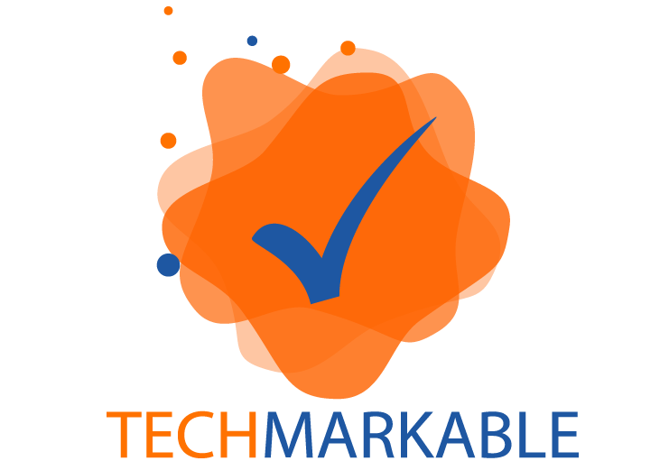

# Techmarkable.com
Techmarkable is a startup company launced in result of our Master Degree Research Project.
Techmarkable is the fusion of Technology and Remarkable. 
We not only wish to leave an imprint by providing extraordinary applications to the users but also create applications that will leave a trend setting impact.
This source code is part of our startup website.

## Requirement 
1. WAMP/ XAMP for runnig PHP source code.
2. Sublime text editor (Optional)

## Usage 
Check out the master branch, git clone it and there after run the project in WAMP or XAMP.

## Issues
Currently, No issues in the project, if found please report.

## License
Not yet.
